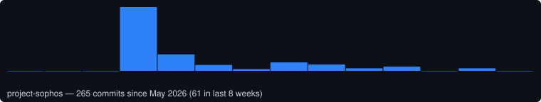
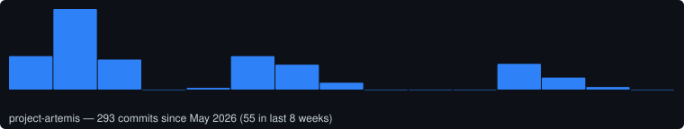
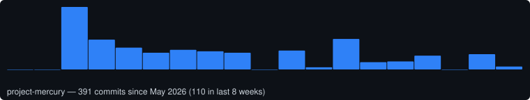
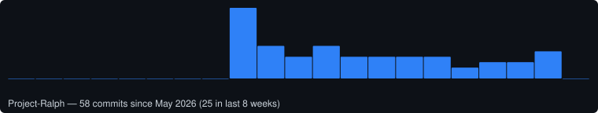
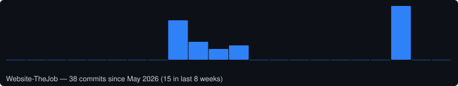

<h1 align="center">Hi, I'm Ralph Liu 👋</h1>

  <em>Building reliable software & data products — turning private work into public results.</em>

  
  
  
  
  

---

## 👨‍💻 About Me

- 🔭 Most of my work lives in **private repositories** (personal and paid client projects), so this profile is where I document what I've built and the impact it delivered.
- 🧠 I care about clean architecture, measurable outcomes, and shipping things that hold up in production.
- 📫 Reach me at **cyliu.analyst@gmail.com** — open to opportunities and collaboration.

> 💡 **Recruiter note:** My contribution graph and stats below **include private contributions**. My public repo count is intentionally low because client work stays private — the numbers reflect real, ongoing output.

---

## 🛠️ Tech Stack

<!-- Edit this list to match your actual stack. Badges from https://shields.io -->

**Languages**

**Frontend**

**Backend & Data**

**DevOps & Tools**

---

## 🚀 Project Highlights

> My repositories are private (client and personal work), so here's what I've built, how it's engineered, and real weekly commit activity pulled straight from each repo.

### 🔹 Sophos Academy — CFA/CPA exam prep platform
**Stack:** `Next.js 16` · `React 19` · `TypeScript` · `PostgreSQL (Supabase)` · `Tailwind CSS` · `Claude Sonnet`
- **What it does:** Live product ([sophosacademy.org](https://sophosacademy.org)) selling expert-reviewed CFA/CPA mock exams, a free practice question bank, and SEO-optimized study guides, with its own purchase/dashboard/admin system.
- **Stands out:** Full commercial stack shipped solo — auth (Google OAuth + magic link), payments (webhook-based checkout, no SDK), AI-generated exam questions with prompt caching, and a 195-test Vitest suite gating every CI run.

### 🔹 Project Artemis — AI recruiting platform
**Stack:** `Next.js 14` · `Node.js/Express` · `TypeScript` · `PostgreSQL` · `Docker` · `Claude Sonnet`
- **What it does:** End-to-end talent-acquisition tool — AI candidate sourcing, 4-dimension AI evaluation streamed live via SSE, auto-triage, interview scheduling by parsing inbound email replies, and AI-drafted candidate/interviewer emails.
- **Stands out:** Multi-tenant SaaS architecture with per-org PostgreSQL schema isolation enforced by a custom CI lint gate, priority job queues (pg-boss) for live vs. background AI evaluation, and prompt-cached JDs so only marginal candidate tokens are billed per evaluation.

### 🔹 Mercury — Wyckoff Box-Zone AI trading system
**Stack:** `Python (asyncio)` · `PostgreSQL` · `Redis` · `FastAPI` · `Docker` · `Claude API`
- **What it does:** Fully automated crypto futures trading system on Gate.io, implementing the Wyckoff Box-Zone methodology end-to-end — zone detection, signal generation, risk-managed execution, and portfolio tracking.
- **Stands out:** 8 independent asyncio agents communicating over a Redis pub/sub bus, a dedicated Sentinel agent enforcing a max-drawdown circuit breaker, and a weekly Evolution agent that uses Claude to tune strategy parameters from live performance.

### 🔹 Project Ralph — agentic AI personal-branding pipeline
**Stack:** `Python` · `GitHub Actions` · `Claude Code` · `LinkedIn API`
- **What it does:** An agentic content pipeline that drafts, validates, and — after human review — automatically publishes this profile's LinkedIn posts on a fixed Mon/Wed/Fri schedule.
- **Stands out:** Hard rule-gated validator (hashtag rules, mandatory verifiable references, length limits, credential-leak scanning) runs in CI on every PR; publishing authority always requires a human merge, never fully autonomous.

### 🔹 Website-TheJob — company marketing site
**Stack:** `Next.js` · `TypeScript` · `Vercel`
- **What it does:** Production marketing website for [thejob.com.tw](https://thejob.com.tw).

Charts show weekly commit counts for the last 52 weeks, pulled from each repo's real commit history and refreshed automatically (see below).

<!--
  Tip: to add an architecture diagram or a screen-recording GIF,
  drop the file in an `assets/` folder in this repo and embed it:
  
-->

---

## 📫 Get in Touch

| Channel | Link |
| --- | --- |
| 📧 Email | [cyliu.analyst@gmail.com](mailto:cyliu.analyst@gmail.com) |
| 💼 LinkedIn | [linkedin.com/in/chieh-yu-liu](https://www.linkedin.com/in/chieh-yu-liu) |
| 📝 Personal Website | [sites.google.com/view/ralph-cy-liu](https://sites.google.com/view/ralph-cy-liu/) |
| 📚 Book | [No-Nonsense Cryptocurrency Investing Concepts for Beginners](https://www.amazon.com/dp/B0FGZ57659) |
| 🐙 GitHub | [github.com/Ralph-Liu-Hub](https://github.com/Ralph-Liu-Hub) |

<em>Thanks for stopping by — let's build something great together. 🚀</em>

